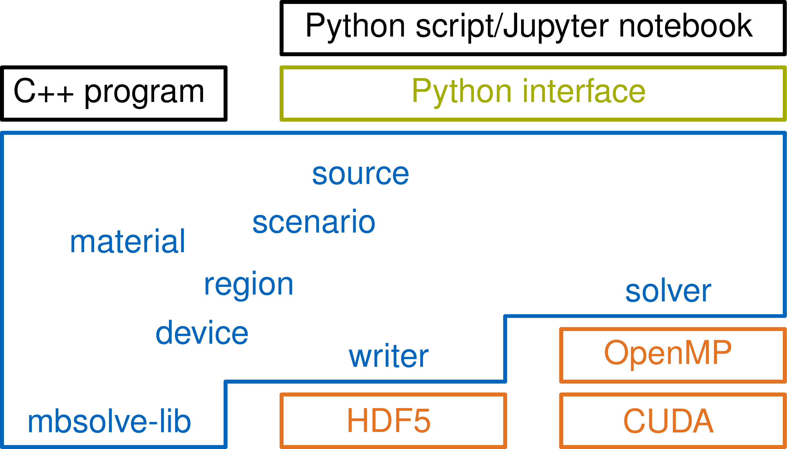

# mbsolve

An open-source solver tool for the full wave 1D Maxwell-Bloch equations.

## Overview

The project consists of the following components:

 - mbsolve-lib: Contains the common base classes for solvers and writers
   (which are subsequently derived and implemented in the other subprojects).
   As the name suggests, the solver class is responsible for solving the
   Maxwell-Bloch equations while the writer class writes the results to a
   file of the respective format. It also provides classes to describe a
   device setup (materials, dimensions, ...) and a simulation scenario
   (simulation settings, sources, ...).

 - mbsolve-tool: A C++ test application that implements various simulation
   setups.

 - solver-cpu: Uses the OpenMP standard to efficiently solve the equation
   system on multi-core CPUs or Intel's Xeon Phi.

 - solver-cuda: Uses NVIDIA's CUDA framework to efficiently solve the equation
   system on graphics processing units (GPUs). Different solvers are
   implemented in this subproject.

 - tools: Various scripts in different scripting languages.

 - writer-hdf5: Writes the results into the HDF5 format.

All libraries feature a Python interface and can be used conveniently from
Python scripts, Jupyter notebooks etc. See tools/python for examples.

## Get the code

Make sure to clone using

    git clone --recurse-submodules [...]

in order to clone third-party libraries recursively. Alternatively, issue

    git submodule update --init --recursive

in the repository if it already exists.

## Build instructions

The project is built using the CMake build system. The typical commands under
Linux are

    $ cd mbsolve
    $ mkdir build
    $ cd build
    $ cmake ..
    $ make -j 8
    $ ./mbsolve [--options]

By default, the build type is set to release with debug information, which
enables debugging but features the optimization necessary for reasonable
performance. Adjust the -j command line parameter of the make command in
order to speed up the compilation.

In order to enable/disable a component, an extra option has to be passed to
CMake:

    $ cmake -DWITH_CUDA=ON/OFF ..

The project has been successfully compiled with the GNU compiler collection
(gcc) and the Intel compiler (icc). gcc is used as default, the Intel compiler
may be used with the following command:

    $ CC=path_to_intel/icc CXX=path_to_intel/icpc cmake -DWITH_CUDA=OFF ..

Note that CUDA does not support all versions of the Intel compiler, hence the
CUDA support is disabled.

The target architecture may be set using the ARCH option. By default, compiler
optimizations suitable for the host machine are applied. However, when
building for another machine the architecture can be set with e.g.

    $ cmake -DARCH=AVX2 ..

The Doxygen documentation can be build with

    $ make doc

If you want to use Eclipse, use the appropriate generator flag -G and (if
desired) set the build type to Debug. (Note that Eclipse yields a warning if
the build directory is a child of the source directory. Adjust path_src.)

    $ cmake -DCMAKE_BUILD_TYPE=Debug -G"Eclipse CDT4 - Unix Makefiles" path_src

## Tools

 - Python scripts: Example scripts that define simulation setups and run the
   solver. Execute from build directory. See tools/python.

 - MATLAB scripts: The examples read the simulation results and plot them.
   See tools/matlab.

 - Slurm scripts: Example scripts for the Slurm Workload Manager.
   See tools/slurm.

## Dependencies

The following software packages are required to build the project:

 - C++ compiler (e.g., gcc >= 4.9)
 - cxxopts (any recent version) for mbsolve-tool
 - CMake (3.6)
 - Eigen library (3.3.4)
 - HDF5 (any recent version) for the writer-hdf5
 - Python (2.7) and SWIG (2.0) for Python support
 - CUDA (7.0) for solver-cuda
 - OpenMP (any recent version) for solver-cpu
 - Doxygen (any recent version) for the documentation

If the required dependencies are not met, the components may be disabled by
the build system. Consider the minimum version given in the brackets.

The runtime dependencies are a reduced set of the list above. Namely, those
are:

 - C/C++ standard libraries including OpenMP support
 - Python runtime
 - HDF5

Naturally, the same versions as used during compilation must be available.

## Contributing to mbsolve

Feel free to use the code and do not hesitate to contact me or to create an
issue on github. Any contributions are welcome. If you found the code helpful
and used it in your research, you can cite the following paper: 
M. Riesch, N. Tchipev, S. Senninger, H.-J. Bungartz, and C. Jirauschek,
"Performance evaluation of numerical methods for the
Maxwell-Liouville-von Neumann equations," Opt. Quant. Electron. <b>50</b>,
112 (2018).
[BIB](https://www.riesch.at/michael/publications/riesch2018oqel.bib)
[PDF](https://www.riesch.at/michael/publications/riesch2018oqel.pdf)
[DOI](http://dx.doi.org/10.1007/s11082-018-1377-4)
